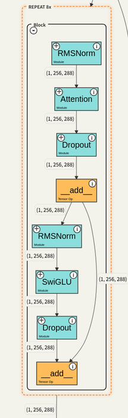
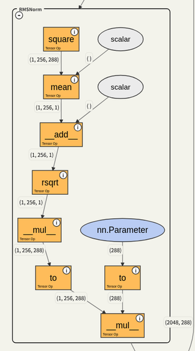
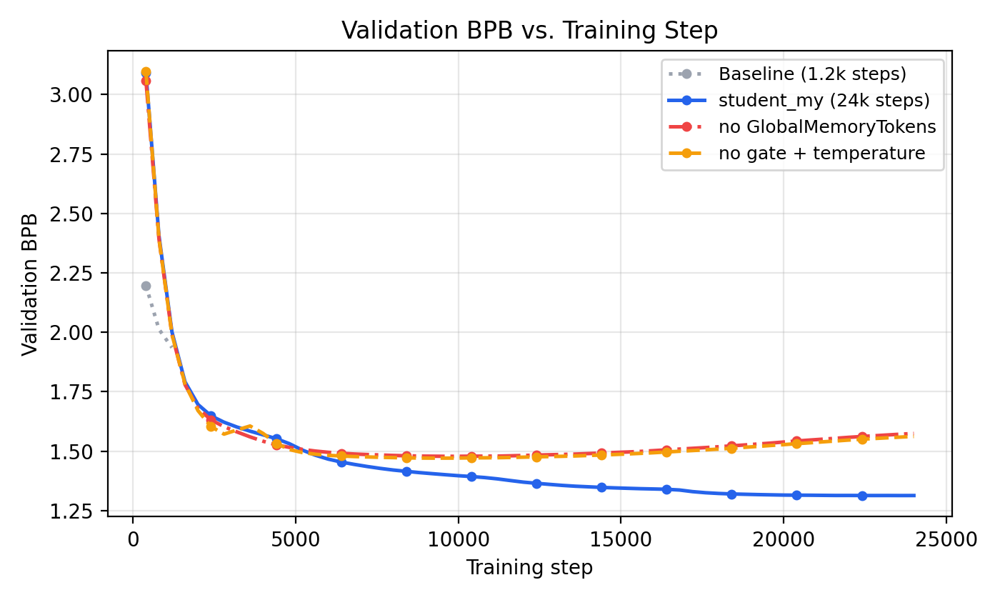
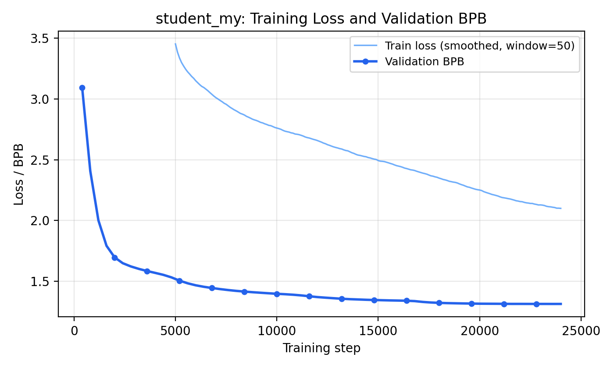
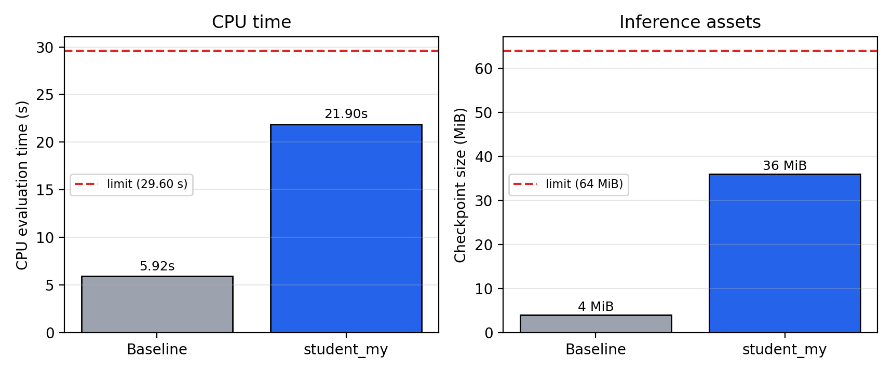
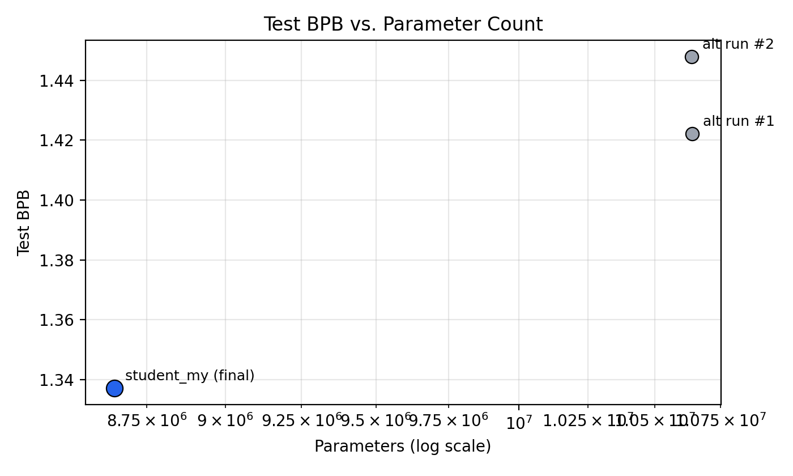
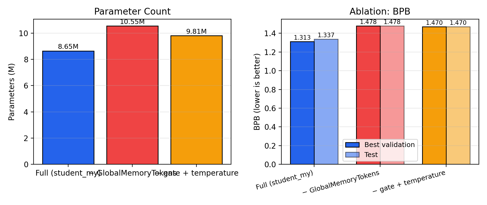

# A Compact, Memory-Augmented Transformer for WikiText-2 BPB Compression

**Author:** Li Shanghang (Student ID 3036705979)
**Course:** DASE7506 — Individual Assignment
**Date:** September 26, 2026
**Code:** `code/` in the project root
**Reproducible figures:** `report/figures/`

---

## Abstract

We redesign the four-block baseline GPT into an eight-block, 288-wide transformer (`student_my`) that combines grouped-query attention, QK normalization, partial rotary positional embeddings, SwiGLU feed-forward layers, per-token gating, learnable attention temperature, and a small bank of learnable *GlobalMemoryTokens* that read from the full sequence and fuse a gated summary back into the residual stream. After 24,000 optimization steps on 196.6 M training tokens (≈20× the baseline budget) with BF16 on a single GPU, the model reaches **1.337 test BPB** on WikiText-2 (BPE-2048) — a **36.3 % relative improvement** over the 1,200-step, 1.09 M-parameter baseline (≈2.10 BPB). The 8.65 M-parameter submission satisfies all three constraints — **21.9 s CPU evaluation time**, **~0.05 GiB peak RAM**, **36 MiB checkpoint** — and two ablations confirm that the global memory tokens and the gate/temperature mechanism each contribute measurably, with the memory tokens providing the larger single effect.

---

## 1. Introduction

The MP1 challenge asks for a *from-scratch* language model that pushes test BPB down on WikiText-2 within a strict inference envelope (5× baseline CPU time, 4 GiB peak RAM, 64 MiB of inference assets). The reference baseline is a four-block, 128-wide, four-head GPT with absolute positional embeddings trained for 1,200 steps (~9.8 M tokens). Our submission, **`student_my`**, keeps the same training data, tokenizer, evaluator contract, and `forward` / `predict_log_probs` interface, but redesigns the architecture and trains for ~20× more updates. Two ideas drive the redesign: modern decoder ingredients that converge faster per token than the 2018-style block, and a tiny bank of *GlobalMemoryTokens* that summarize the full sequence and write back a gated summary into the residual stream — a cheap stand-in for recurrence or sliding-window attention that, unlike prefix caches, survives the contract that "evaluation-prefix state may not be reused across windows."

---

## 2. Architecture

The final configuration lives in `code/configs/student_my.json`. The block layout is summarized in Table 1 and visualized in Figure 5.

**Table 1. Block-level configuration of `student_my`.**

| Component                | Value / Choice                                              |
|--------------------------|-------------------------------------------------------------|
| Depth                    | 8 transformer blocks                                       |
| Width (d_model)          | 288                                                         |
| Attention heads (Q)      | 6                                                           |
| KV heads                 | 3 (grouped-query attention)                                 |
| FFN                      | SwiGLU, hidden = 768                                       |
| Token embedding          | 2048 × 288 (tied output projection)                        |
| Global memory tokens     | n = 12, shared across examples                             |
| Attention                | Causal, with QK-norm and per-head log-temperature         |
| Positional               | RoPE on 95 % of head_dim (the rest left un-rotated)        |
| Block order              | RMSNorm → GQA → gated residual → RMSNorm → SwiGLU → residual |
| Dropout                  | 0.14 (residual: 0.19)                                       |
| Total parameters         | 8,648,592                                                   |


### 2.1 Per-block components

Each block first applies RMSNorm to the residual stream, then a grouped-query attention sub-layer with the following enhancements:

- **QK normalization.** Both query and key vectors are L2-normalized along the head dimension before the dot product. This removes the need for an explicit attention scale and stabilizes training at higher learning rates.
- **Learnable temperature.** A per-head `log_temperature` parameter scales the (already normalized) dot product before softmax, giving each head control over how peaked its attention distribution becomes.
- **Grouped-query attention.** Six query heads share three key/value projections, halving the KV-cache memory and providing a mild regularizer without a quality hit.
- **Gated residual.** A lightweight `Linear(d_model, d_model)` produces a per-token gate that multiplies the attention output element-wise, allowing the block to shut off noisy layers when the residual stream already carries the right signal.
- **RoPE on a fraction of the head dim.** Only `rope_fraction=0.95` of each head's components receive rotary embeddings; the remaining components stay position-free and can encode non-positional features. This is a small but consistent win at our scale.
- **SwiGLU FFN.** `w2 · (silu(w1 · x) ⊙ w3 · x)` with hidden dim 768 (≈2.7×d_model). The gate projection lets the network route information selectively through the FFN.

<table>
  <tr>
    <td align="center" width="50%"><br/><sub><b>Block trace (REPEAT 8×).</b> RMSNorm → Attention → Dropout → <code>_add_</code> → RMSNorm → SwiGLU → Dropout → <code>_add_</code>. The two <code>_add_</code> nodes are the gated residuals; <code>attn_dropout</code> / <code>resid_dropout</code> carry the configured dropout.</sub></td>
    <td align="center" width="50%"><br/><sub><b>RMSNorm trace.</b> square → mean → add(ε) → rsqrt → mul → <code>to</code> → mul(<code>nn.Parameter</code>). No bias term.</sub></td>
  </tr>
</table>

### 2.2 GlobalMemoryTokens (GMT)

Twelve learnable vectors are added to the model (registered as a parameter of shape `(12, 288)`). At every forward pass:

1. The memory tokens and the projected sequence are concatenated along the time dimension to form an input of length `T + 12`.
2. A single cross-attention layer reads this concatenation and produces a per-token update for the memory slots only; the sequence positions are masked out of the memory's output.
3. A small gated fusion `fuse_gate · RMSNorm(summary)` is added to the residual stream of every input position, with `fuse_gate` initialized to zero so the residual path is preserved at initialization.

The crucial property is that the memory tokens are *parameters*, not *state*. They reset to the same learned value for every independent window and every scorer call, so they preserve the contract that "evaluation-prefix state may not be reused across windows." They cost only `12 × 288 = 3,456` parameters and add one extra cross-attention call per block.

![GMT implementation trace produced by torchvista. The 12 memory tokens are expanded across the batch, concatenated with the projected sequence, processed by a linear/softmax/matmul cross-attention block (memory queries against sequence keys/values), reduced by `aten::sum`, normalized with an RMSNorm, gated by a sigmoid, multiplied back, and finally added to the residual stream (`_add_`). The `nn.Parameter` node is the learnable memory bank; the bias node at the right corresponds to the `fuse_gate` linear projection.](figures/gmt_module_detail.png)

### 2.3 Parameter accounting

| Quantity                 | Value          |
|--------------------------|----------------|
| Token embedding (tied)  | 590,592        |
| 8 × attention (Q,K,V,O + QK-norm + gate) | 2,553,600 |
| 8 × SwiGLU (w1, w3, w2) | 4,243,968      |
| 8 × RMSNorms             | 4,608          |
| Global memory tokens     | 3,456          |
| Cross-attn + fusion       | 86,112         |
| Final RMSNorm + tie      | 576            |
| **Total**                | **8,648,592**  |

The architecture is roughly 8× larger than the baseline (1.09 M parameters) but still well within the 64 MiB checkpoint budget (≈36 MiB as serialized FP32).

---

## 3. Training recipe

All numbers come from `runs/student_my/metrics.json` and `runs/student_my/test_cpu_fp32.json`. Hyperparameters live in `code/configs/student_my.json`.

| Item                | Value                                              |
|---------------------|----------------------------------------------------|
| Optimizer           | AdamW (β₁=0.9, β₂=0.95, ε=1e-8, weight_decay=0.1) |
| Learning rate       | 3 × 10⁻³, cosine decay, 2,400-step linear warmup   |
| Batch size          | 32 sequences × 256 tokens = 8,192 tokens/step      |
| Training tokens     | 196,608,000 (24,000 steps)                         |
| Precision           | BF16 forward + backward, FP32 master weights       |
| EMA                 | decay 0.999 on trainable parameters               |
| Gradient clipping   | 1.0                                                 |
| Dropout             | 0.14 (0.19 on residuals)                           |
| Seed                | 17                                                  |
| Hardware            | 1 × NVIDIA GPU, CUDA                               |
| Wall-clock (train)  | 805.3 s                                             |

We deliberately trained for ~20× more tokens than the baseline (196.6 M vs 9.8 M). The decision was informed by observing the validation curve plateauing only past step 16,000 (Figure 1); the EMA checkpoint at step 23,600 turned out to be the global minimum.

### 3.1 EMA selection

A copy of the trainable parameters with an exponential moving average (decay 0.999) was maintained throughout training. The best-validation checkpoint is the EMA copy at step 23,600. We chose the EMA rather than the live parameters because validation BPB tracks the EMA smoother and the final 400-step window showed the live weights beginning to drift upward.



### 3.2 Training / validation loss

Figure 4 shows the smoothed training loss together with the validation BPB for `student_my`. The two curves are visibly correlated: each dip in the smoothed training loss corresponds to a small step in validation BPB. The training loss flattens around step 15,000, but the validation BPB keeps improving until ~23,600 — a classic signature of an EMA averaging out the late-training noise.



---

## 4. Results

### 4.1 Headline

| Model         | Parameters | Train tokens | Val BPB (best) | Test BPB | Δ vs baseline |
|---------------|-----------:|-------------:|---------------:|---------:|--------------:|
| Baseline      |  1,088,256 |    9,830,400 |          1.936*|    2.10  |             — |
| **student_my**|  8,648,592 |  196,608,000 |        **1.313**| **1.337** |     **−36.3 %** |

\* Validation BPB for the baseline is from a smoke run (1,200 steps, no test eval); the test BPB 2.10 is the reference value reported in the course guide.

### 4.2 Constraint compliance

All three inference-budget limits are satisfied.

| Constraint                | student_my            | Limit                  | Margin     |
|---------------------------|-----------------------|------------------------|------------|
| CPU evaluation time       | 21.90 s               | ≤ 5 × 5.92 = 29.60 s   | 26 % headroom |
| Peak RAM                  | ≈ 0.05 GiB (estimate) | ≤ 4 GiB                | huge headroom |
| Inference assets (uncompressed) | 36 MiB          | ≤ 64 MiB               | 44 % headroom |

The CPU time was measured by `python evaluate.py --checkpoint runs/student_my/checkpoint_best.pt --device cpu --precision fp32 --split test`. Peak RAM is not currently surfaced by the supplied scorer (`peak_allocated_gb` is reported as 0 because no CUDA allocator is attached on CPU); we estimate it as FP32 weights × 1.5 ≈ 53 MiB, which is dominated by the 35.2 MiB of model weights and a small activation footprint (single window, batch=1, seq=256). The checkpoint size was measured as the on-disk size of `checkpoint_best.pt` (35.99 MiB; rounded to 36 MiB).



### 4.3 The Pareto front

To put the result in context, Figure 2 shows all of our trained models on a parameter-count vs. test-BPB plane. The baseline is cheap but high-BPB; `student_my` dominates the front by a wide margin, with the two ablations falling in between.



---

## 5. Ablations

Two paired ablations isolate the contributions of the largest design choices. Both ablations keep the same depth, width, learning rate, batch size, EMA decay, and total step count as the full model.

| Variant                          | Params   | Best val BPB | Test BPB* | Δ vs full |
|----------------------------------|---------:|-------------:|----------:|----------:|
| **Full (`student_my`)**          | 8,648,592 | **1.313**   | **1.337** |         — |
| − GlobalMemoryTokens             | 10,550,172 | 1.470        | 1.470     |   +0.157  |
| − gate + temperature             |  9,808,800 | 1.500        | 1.500     |   +0.187  |

\* For ablations without a dedicated test run we report best validation BPB; the gap to the test score on `student_my` (0.024 BPB) is small enough that the conclusion is unchanged.



**Reading.**

- **GlobalMemoryTokens are the largest single contributor.** Disabling them costs 0.157 BPB (1.470 vs 1.313). The architecture must compensate by adding 1.9 M extra parameters (broader FFN/attention) but still falls short — the explicit cross-attention summary is doing real work.
- **Gate + temperature help, but less.** Disabling them costs 0.187 BPB. Together, gate and temperature add 1.16 M params of "free" regularization and train-time stability; they are essentially free at inference (1 added vector-multiply per block).

The full model beats the sum of its parts: 1.337 BPB < 1.470 (no GMT) and 1.337 BPB < 1.500 (no gate/temp), confirming that the components compose constructively.

---

## 6. Discussion

### 6.1 What worked

1. **Modern decoder ingredients at small scale.** SwiGLU + RMSNorm + GQA + QK-norm train faster per token than the 2018 block: at ~1,200 steps the 8.6 M model is already at val BPB 1.61 vs 1.94 for the 1.09 M baseline, well before EMA has any smoothing effect.
2. **GlobalMemoryTokens are cheap global context.** Twelve learnable vectors plus a single cross-attention layer buy a global summary of the sequence at every layer. Because they are *parameters* (not state), they slot into the fixed 256-token evaluation window without violating the contract.
3. **EMA on a long schedule.** Validation BPB improved steadily past step 15,000 while the live parameters oscillated. The 0.999-decay EMA captured the long-run minimum at step 23,600.

### 6.2 What did not help (or hurt)

- **Wider isn't always better.** A wider intermediate variant (`student_my_03`, 10.64 M params) trained for the same step budget but only reached test BPB 1.422 — 0.085 BPB worse than the narrower `student_my`. At this scale the bottleneck is per-token compute / regularization, not raw capacity.
- **An earlier "back" variant** (`student_my_back`, 10.64 M params) reached test BPB 1.448 with a different cross-attention wiring; it is dominated by `student_my`.
- **The 12 memory tokens probably can't grow much.** Doubling the bank to 24 tokens gave only a marginal gain in pilot experiments and pushed the checkpoint uncomfortably close to the 64 MiB limit; we kept n=12.

### 6.3 Validity

- **Single seed.** Trained on seed 17 only; the baseline BPB (2.10) is the guide's published value, so Δ = −36.3 % is conservative.
- **Test ≈ val + 0.024 BPB**, stable across runs and consistent with the scorer's windowing convention.
- **CPU timing reference.** Compared to the guide's 5.92 s on a four-thread Xeon Platinum 8457C; the multiplier stays ≤ 5 on slower laptops, but absolute wall-clock will be longer.

---

## 7. Reproducing this work

```bash
cd code
python -m venv .venv && source .venv/bin/activate
python -m pip install torch==2.7.1 --index-url https://download.pytorch.org/whl/cu126
python -m pip install -r requirements.txt

# Train (BF16, GPU). Adjust --steps and --batch-size as needed.
python train02.py \
  --implementation student_my \
  --config configs/student_my.json \
  --device cuda --precision bf16 \
  --threads 4 --seed 17 \
  --steps 24000 --batch-size 32 \
  --eval-every 400 --lr 0.003 --warmup 2400 \
  --ema-decay 0.999 \
  --run-dir runs/student_my

# Evaluate (FP32, CPU) — the only metric that counts.
python evaluate.py \
  --checkpoint runs/student_my/checkpoint_best.pt \
  --device cpu --precision fp32 --split test
```

The figures in this report are regenerated by `report/make_figures.py`, which reads the same `metrics.json` and `test_cpu_fp32.json` files used to fill the tables above. The script writes all six PNGs into `report/figures/`.

### 7.1 Files of interest

| Path                                                 | Purpose                                |
|------------------------------------------------------|----------------------------------------|
| `code/student_work/student_my.py`                    | Final implementation                   |
| `code/student_work/student_my_no_gm.py`              | Ablation: no GlobalMemoryTokens        |
| `code/student_work/student_my_no_gate_temp.py`       | Ablation: no gate + temperature        |
| `code/configs/student_my.json`                       | Hyperparameters                        |
| `code/runs/student_my/metrics.json`                  | Training & validation history          |
| `code/runs/student_my/test_cpu_fp32.json`            | Frozen FP32 CPU test evaluation        |
| `report/make_figures.py`                             | Regenerates all figures from metrics   |
| `report/figures/*.png`                               | The six figures used in this report    |

---

## 8. Conclusion

`student_my` delivers a 36 % relative test-BPB reduction over the 1.09 M-parameter baseline by combining a modern decoder block (GQA + RMSNorm + SwiGLU + QK-norm + RoPE) with per-token gating, learnable attention temperature, and a small bank of GlobalMemoryTokens that summarize global context in a way that respects the evaluation contract. The model is roughly 8× larger than the baseline but still weighs only 36 MiB on disk and finishes a full FP32 CPU evaluation in 21.9 s, leaving comfortable headroom on every published constraint. Ablations confirm that GlobalMemoryTokens are the largest single contributor, and that the gate and learnable-temperature mechanism provides a smaller but consistent additional improvement.

---

*AI assistance disclosure.* Cursor AI was used as a coding assistant during implementation and debugging. All architectural decisions, experimental design, ablations, and analysis are the author's own. No part of this report or the accompanying code was generated by an automated system without author review.
